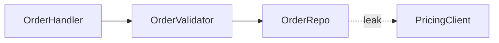
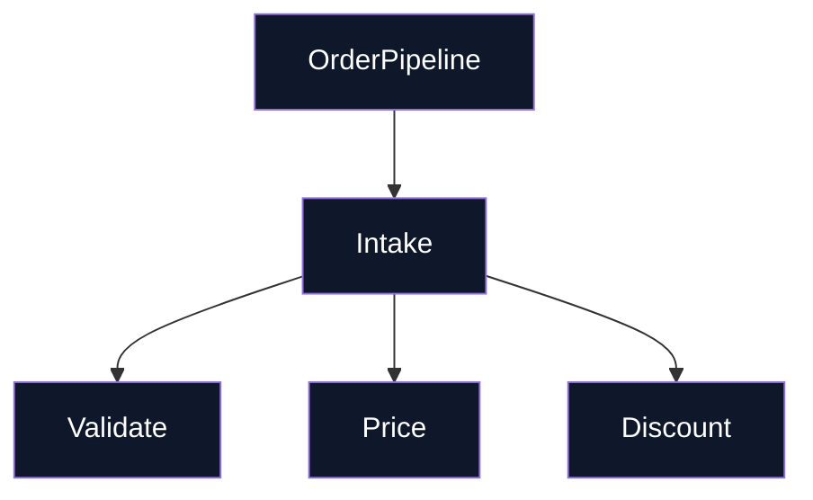

# Markdown Report Format

The architectural review is a Markdown document placed in the OS temp directory so nothing lands in the repo. Markdown provides headers, lists, code blocks, tables, and fenced diagrams — everything needed without CDN imports or layout engines.

## Scaffold

Start the document with a level-1 heading for the repo name, followed by a brief metadata line with the date. Skip introductions — jump straight into the candidates.

```markdown
# Architecture Review — {{repo name}}

<!-- {{date}} -->

## Candidates

## Top Recommendation

---
```

## Legend

Place a compact legend near the top so readers decode the diagram notation immediately:

```markdown
> **Legend**: 📦 Module · ── Seams · 🔴 Leakage · 🟢 Deep module · ⚠️ ADR conflict
```

Or spell it out in prose:

```markdown
**Notation**: Modules are code blocks. Solid arrows denote normal flow. Red-highlighted items indicate leakage across seams. Thick-bordered boxes indicate deep modules.
```

## Candidate card

Prose is sparse, plain, and uses the glossary terms ([LANGUAGE.md](LANGUAGE.md)) without ceremony. Diagrams carry the weight.

Each candidate is a level-2 heading (with anchor links between cards via `[candidate-1]: #candidate-1`):

```markdown
## Collapse the Order Intake Pipeline

**Strength**: Strong · **Dependency**: local-substitutable

### Files

- `internal/order/intake.go`
- `internal/order/validator.go`
- `internal/order/pricing_adapter.go`
- `internal/order/discount_handler.go`

### Problem

The intake pipeline spreads pricing logic across four modules — callers pay for four interfaces when they really need one.

### Solution

Consolidate the four modules into one deep module with a single method accepting `(order.Order) (*Result, error)` — pricing becomes internal detail.

### Benefits

- Tests hit one interface instead of four
- Pricing logic stops leaking into callers
- Delete four shallow wrappers

### Before / After

#### Before



#### After



### ADR Note

⚠️ Contradicts ADR-0007 — but worth reopening because the current split forces callers to coordinate four error paths manually.
```

## Diagram patterns

Pick the pattern that fits the candidate. Mix them. Don't make every diagram look identical — variety signals thinking, not templating.

### Mermaid graph (the workhorse for dependencies / call flow)

Fenced Mermaid `flowchart` or `graph` blocks serve the same role as the HTML Mermaid containers. The Mermaid CDN renders them automatically in most Markdown viewers.

```markdown

```

Style with `classDef` to color-code leakage and deep modules — the same class-based coloring available in Mermaid's browser renderer translates to colored cells in rendered views.

### Hand-built ASCII art (when Mermaid's layout fights you)

Use ASCII boxes-and-arrows when Mermaid's forced layout distorts the relationship. Plain-text boxes align naturally in Markdown:

```markdown
#### Before

┌──────────────┐  ┌──────────────┐  ┌──────────────┐
│ OrderHandler │→│ Validator    │→│ DiscountHdlr │
└──────────────┘  └──────────────┘  └──────────────┘
                        ↑              ↑
                  ┌──────────┐  ┌──────────┐
                  │ Pricer   │←│ Client   │
                  └──────────┘  └──────────┘

#### After

┌──────────────────────────────────────┐
│            OrderPipeline             │
│  ┌──────────┬──────────┬──────────┐  │
│  │ Validate │ Price   │ Discount │  │
│  └──────────┴──────────┴──────────┘  │
└──────────────────────────────────────┘
```

### Cross-section (layered shallowness)

Horizontal bars separated by blank lines show layers a call passes through. Before: six thin layers. After: one thick block:

```markdown
#### Before

```
Layer 1: parse_order()
Layer 2: validate_qty()
Layer 3: lookup_price()
Layer 4: apply_discount()
Layer 5: calculate_tax()
Layer 6: persist()
```

#### After

```
┌────────────────────────────────────────┐
│               process(order)            │
│                                        │
│  parse → validate → price → tax → save │
│                                        │
└────────────────────────────────────────┘
```
```

### Mass diagram (interface width vs implementation height)

Markdown tables express interface size vs implementation size concisely:

```markdown
#### Before (shallow)

| Module | Methods | Lines | Ratio |
|--------|---------|-------|-------|
| Handler | 4 | 120 | 0.95 |
| Validator | 3 | 110 | 0.88 |
| Adapter | 2 | 95 | 0.82 |

#### After (deep)

| Module | Methods | Lines | Ratio |
|--------|---------|-------|-------|
| Pipeline | 1 | 350 | 0.15 |
```

### Call-graph collapse

Nested unordered lists simulate nesting — collapse turns a deep tree into a flat box:

```markdown
#### Before

- `HandleOrder()`
  - `parseRequest()`
  - `validateQty()`
  - `priceItem()`
    - `lookupSKU()`
    - `applyCoupon()`
  - `persist()`

#### After

- `Process(order)` — all eight functions live inside
```

## Style guidance

- Headings establish hierarchy: H1 = repo, H2 = candidate, H3 = subsections within a card.
- Fences delimit diagrams and code. Three backticks for Mermaid, four backticks for raw text/ASCII art.
- Tables summarize quantitative comparisons (method counts, LOC ratios, call depths).
- Block quotes (`>`) for legends, annotations, and ADR callouts.
- Horizontal rules (`---`) to separate major sections.
- Anchor links between candidates via label-style anchors (`[candidate-x]: #anchor-id`) so readers can navigate between sections.
- Emoji sparingly — only for the legend or to flag anomalies (🔴 for leakage, ⚡ for deep modules, ⚠️ for ADR conflicts).
- No inline HTML. Pure Markdown.

## Top recommendation section

A level-2 heading after the candidates. Brief rationale — one sentence explaining why this candidate tops the rest. Link back to the relevant candidate card:

```markdown
## Top Recommendation

Collapse the Order Intake Pipeline — consolidates five shallow modules into one deep module, eliminates seven cross-module error paths, and brings test coverage from fragmented to unified. See [above ↗].
```

## Tone

Plain English, concise — architectural nouns and verbs come straight from [LANGUAGE.md](LANGUAGE.md). Concision is not license to drift.
